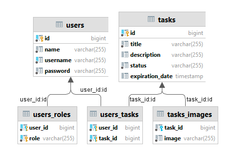

# Task List

This application helps you organize creating and accessing tasks for users.

You can access Swagger and see all available endpoints by visiting http://localhost:8080/swagger-ui/index.html

## Tech Stack

- Java 19
- Spring Boot, Spring Security
- JDBC
- MyBatis
- PostgreSQL
- Swagger
- Docker


## Database



We have two main classes - **User** and **Task**.

**User** class represents user in this application. User can login, create and update tasks.

User can have roles - `ROLE_USER` or `ROLE_ADMIN`.

**Task** class represents task in this application. Task can be created by user.

## Environment Variables

To run this project, you will need to add the following environment variables to your .env file

- `HOST` - host of Postgresql database
- `POSTGRES_USERNAME` - username for Postgresql database
- `POSTGRES_PASSWORD` - password for Postgresql database
- `POSTGRES_DATABASE` - name of Postgresql database
- `POSTGRES_SCHEMA` - name of Postgresql schema
- `JWT_SECRET` - secret string for JWT tokens

## API Reference

### Authentication API

#### Registration

```http
  POST /api/v1/auth/register
```

```json
{
  "id": 1,
  "name": "John Doe",
  "username": "johndoe@gmail.com",
  "password": "12345",
  "passwordConfirmation": "12345"
}
```

#### Login

```http
  POST /api/v1/auth/login
```

```json
{
  "username": "johndoe@gmail.com",
  "password": "12345"
}
```

#### Refresh token

```http
  POST /api/v1/auth/refresh
```

| Request Body | Type     | Description                     |
|:-------------| :------- |:--------------------------------|
| `token`      | `string` | **Required**. Your access token |

### User API

#### Update user

```http
  PUT /api/v1/users
```
```json
{
  "id": 1,
  "name": "John Doe",
  "username": "johndoe@gmail.com",
  "password": "12345",
  "passwordConfirmation": "12345"
}
```

#### Get user by id

```http
  GET /api/v1/users/{id}
```

| Request Body | Type  | Description           |
|:-------------|:------|:----------------------|
| `id`         | `int` | **Required**. User ID |

#### Delete user by id

```http
  DELETE /api/v1/users/{id}
```

| Request Body | Type  | Description           |
|:-------------|:------|:----------------------|
| `id`         | `int` | **Required**. User ID |

#### Get all users task

```http
  GET /api/v1/users/{id}/tasks
```

| Request Body | Type  | Description           |
|:-------------|:------|:----------------------|
| `id`         | `int` | **Required**. User ID |

#### Create task

```http
  GET /api/v1/users/{id}/tasks
```

```json
{
  "id": 0,
  "title": "string",
  "description": "string",
  "status": "TODO",
  "expirationDate": "2023-11-14T08:42:59.217Z"
}
```

| Request Body | Type  | Description           |
|:-------------|:------|:----------------------|
| `id`         | `int` | **Required**. User ID |

### Task API

#### Update task

```http
  PUT /api/v1/tasks
```
```json
{
  "id": 0,
  "title": "string",
  "description": "string",
  "status": "TODO",
  "expirationDate": "2023-11-14T08:44:16.894Z"
}
```

#### Get task by id

```http
  GET /api/v1/tasks/{id}
```

| Request Body | Type  | Description           |
|:-------------|:------|:----------------------|
| `id`         | `int` | **Required**. Task ID |

#### Delete task by id

```http
  DELETE /api/v1/tasks/{id}
```

| Request Body | Type  | Description           |
|:-------------|:------|:----------------------|
| `id`         | `int` | **Required**. Task ID |


